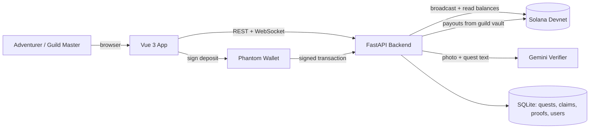

# ⚔️ SolGuild (BountyBlink)

### *The adventurer's guild for the real world. Post a quest, lock the reward, get paid for proof.*

    

> You know those fantasy stories where a guild board is full of quests, and someone brave takes one on and comes back with proof? That is this app. Except the quests are real, the cities are real (Berlin, Paris, Rome...), and the reward is real money on the blockchain.

---

## 📖 Table of Contents

1. [The Problem](#-the-problem)
2. [Our Answer](#-our-answer)
3. [How a Quest Works](#-how-a-quest-works)
4. [The Three Guild Boards](#-the-three-guild-boards)
5. [How Proof Is Checked](#-how-proof-is-checked)
6. [What Happens When You Fail](#-what-happens-when-you-fail)
7. [Ranks and Experience](#-ranks-and-experience)
8. [Try It in 3 Minutes](#-try-it-in-3-minutes-for-judges)
9. [Tech Stack](#-tech-stack)
10. [How the Pieces Fit](#-how-the-pieces-fit)
11. [Project Map](#-project-map)
12. [Run It Yourself](#-run-it-yourself)
13. [Honest Limits](#-honest-limits)
14. [What Comes Next](#-what-comes-next)

---

## 😩 The Problem

Small jobs in the real world are hard to hand off to strangers.

- Your neighbour's cat is missing, and you are at work.
- Your friend had too much to drink and someone needs to drive their car home.
- A shop wants a short video of their new product, filmed by a real person standing in a real street.

Today you either trust a stranger blindly and pay first, or the helper does the work and hopes you pay after. **Someone always has to trust someone.**

## 💡 Our Answer

**SolGuild removes the trust problem.**

1. The person who needs help **locks the reward** before the quest goes live.
2. A helper takes the quest and **sends back a photo** from the exact spot.
3. The system **checks the proof**: right place? right thing? a real photo?
4. If the proof is good, the **reward is paid out automatically**. If not, the reward stays locked and the quest goes back on the board.

Nobody can run off with the money. Nobody has to work for free.

---

## 🗺️ How a Quest Works

```
 Guild Master (poster)                              Adventurer (helper)
 ─────────────────────                              ───────────────────
 1. Writes the quest, picks the spot
 2. Locks SOL in the guild vault  ─────────────►  quest appears on the board
                                                  3. Claims it (timer starts)
                                                  4. Goes there, takes a photo
                                                  5. Uploads the proof
                      ┌───────── The Verifier checks 3 things ─────────┐
                      │  Right place?  Right thing?  Real photo?       │
                      └────────────────────┬───────────────────────────┘
                             pass ─────────┴────────── fail
                              │                          │
                   Reward is paid out        Reward stays locked.
                   +50 EXP for helper        Quest goes back to the board
                                             with a "Failed 1x" badge.
```

Every deposit and payout is a **real transaction on Solana Devnet**. You can click any transaction link in the app and see it on Solana Explorer.

---

## 🏰 The Three Guild Boards

Every quest belongs to one of three boards. Each one has its own rules for what counts as proof.

| Board | What it is | Example quests | What you must hand in |
|---|---|---|---|
| 🤝 **Civil Help** | Everyday kindness | Find a lost cat near the fountain. Drive a friend's car home safely. Water someone's plants. | One clear photo taken at the location |
| 🕵️ **Sensitive** | Careful, serious work | Confirm who owns a vehicle at a depot. Trace where an antique came from. Walk a VIP safely through the old town. | A photo **and** a written investigation letter **and** the source of your information |
| 🛍️ **Commercial** | Content and products | Film a short ad for a bakery. Photograph a new boot on a real shop shelf. | A photo or video-style capture of the item, at the shop |

**8 European cities, 88 starter quests:** London, Paris, Berlin, Madrid, Rome, Amsterdam, Barcelona, Vienna. At least 10 in each, a mix of all three boards. We focus on Europe only.

### 📜 Why Sensitive quests ask for more

A photo alone is not enough proof for sensitive work. So the helper also writes a **field report** (at least 35 characters) and states **where the information came from** (for example: "saw it in person", "municipal record", "spoke to a witness"). The AI reads the letter *and* looks at the photo, and checks that they agree with each other.

---

## 🔍 How Proof Is Checked

Every upload goes through three gates, in order. Fail one and it stops there.

| Gate | Question it asks | How |
|---|---|---|
| **Gate 1: Intake** | Is this a real image file? | Opens and validates the file, saves a fingerprint (SHA-256) so the same photo cannot be reused |
| **Gate 2: Location** | Were you actually there? | Reads GPS from the photo (or your device) and measures the distance to the quest pin. Must be within **150 metres** |
| **Gate 3: Vision** | Is it the right thing, and is it real? | **Gemini 3.1 Flash-Lite** looks at the photo with the quest description. It rejects screenshots, photos of screens, stock images and unrelated pictures. It must be at least **80% confident** (75% for Sensitive, plus the letter checks) |

When something is rejected, you see **why**, in plain words, for 5 seconds before the quest returns to the board.

---

## 🛡️ What Happens When You Fail

This part matters, so we made it very clear.

- The helper's proof is rejected, and a red card explains the reason.
- **The reward does NOT go back to the poster's wallet.** It stays locked in the guild vault.
- The quest returns to the board as **Open**, with a **"Failed 1x"** badge, so the next adventurer can try.
- The helper who failed is released from the quest. Nobody is stuck.
- If a helper claims a quest and never submits, the timer runs out and the quest also returns to the board automatically.

---

## 🎖️ Ranks and Experience

Every completed quest gives the helper **50 EXP**. EXP climbs a rank ladder, just like in the stories.

| Rank | Title | Quests done |
|---|---|---|
| F | Novice Adventurer | 0 (start here, empty bar at 0 EXP) |
| E | Apprentice | 1 |
| D | Proven | 2 |
| C | Skilled | 5 |
| B | Veteran | 9 |
| A | Elite | 16 |
| S | Grandmaster | 30 |

Your **Guild License** page shows your name, rank, progress bar, quests posted, quests completed and SOL earned. Choose your own alias there.

---

## ⏱️ Try It in 3 Minutes (for judges)

**You need:** the [Phantom wallet](https://phantom.app/) browser extension set to **Devnet**. That's it. The app tops up your wallet with a little test SOL.

1. **Open the app** and press **Enter Guild Board**.
2. **Connect Phantom.** A little test SOL arrives automatically.
3. **Set your alias** on the Guild License page and verify your email (in this demo the code is shown on screen).
4. **Issue a quest.** Pick a board, pick a spot in Europe, set a reward (try `0.035 SOL`). Phantom asks you to approve the deposit. Click the transaction link afterwards: it is real and visible on Solana Explorer.
5. **Switch to a second wallet** (or use the **Demo tools** drawer) and **claim** the quest.
6. **Submit proof.** Use the Demo tools to try both outcomes:
   - ✅ *Valid proof* → reward is paid out, helper gets +50 EXP.
   - ❌ *Fake proof* → 5-second rejection card, reward stays locked, quest returns with **Failed 1x**.
7. Open **Activity** to see the full audit trail of locks, payouts and links.

> 💡 The **Demo tools** drawer exists so you can test both results quickly without flying to Madrid.

---

## 🧰 Tech Stack

| Part | What we used | Why |
|---|---|---|
| **Frontend** | Vue 3, TypeScript, Vite, Tailwind CSS 4 | Fast, clean, and easy to follow |
| **Map** | MapLibre GL | Open-source map with quest pins |
| **Wallet** | Phantom + `@solana/web3.js` | The most common Solana wallet |
| **Backend** | FastAPI (Python), SQLAlchemy, SQLite | Simple and quick to run anywhere |
| **Blockchain** | Solana Devnet (`solders`, `solana`) | Real transactions, test money only |
| **AI Verifier** | Google Gemini 3.1 Flash-Lite (structured JSON output) | Reads photos and letters, answers in a fixed format |
| **Live updates** | WebSockets (`/ws/quests`) | New quests and claims show up instantly for everyone |
| **Address search** | OpenStreetMap Nominatim | Find a street without needing a paid map service |

---

## 🧩 How the Pieces Fit



**Plain version:**

- The **app** shows the board, the map and your profile.
- **Phantom** is where you approve moving your SOL. We never see your keys.
- The **backend** keeps the quest list, runs the three gates, and pays out from the **guild vault**.
- **Solana Devnet** is the public ledger where every deposit and payout is recorded.
- The backend also relays your signed transaction to Solana. This avoids the browser being blocked by busy public servers.

---

## 🗂️ Project Map

```
BountyBlink/
├── README.md                    ← you are here
├── implementation_plan.md       ← design notes and the plan behind recent fixes
├── fixtures/                    ← reserved for demo images
├── backend/
│   ├── main.py                  ← the API: quests, claims, proofs, payouts, profiles, live feed
│   ├── models.py                ← database tables (Task, Claim, Submission, User…)
│   ├── solana_service.py        ← the guild vault: sends SOL, reads balances, relays transactions
│   ├── verifier_service.py      ← the 3-gate proof checker (and the Gemini calls)
│   ├── seed_data.py             ← the 88 starter quests across 8 European cities
│   ├── config.py                ← settings (RPC list, geofence, timers, AI model)
│   └── requirements.txt
└── frontend/
    ├── vite.config.ts           ← dev server + proxy to the backend
    └── src/
        ├── App.vue              ← the main screen: board, map, quest details, activity
        ├── composables/         ← logic kept out of the screens
        │   ├── useWallet.ts     ← Phantom connect, balance, escrow deposit
        │   ├── useGuildSocket.ts← live updates
        │   └── useSolPrice.ts   ← SOL → USD display
        └── components/          ← the building blocks
            ├── PostTaskForm.vue          ← issue a quest
            ├── SensitiveDossierModal.vue ← photo + letter + source form
            ├── VerificationSteps.vue     ← the live 4-step checker display
            ├── MapCanvas.vue             ← map with quest pins
            ├── ProfileView.vue           ← Guild License, rank, EXP
            ├── StatusWord.vue / StatusStamp.vue ← Open, Failed 1x, Paid labels
            ├── TxLink.vue                ← opens a transaction on Solana Explorer
            ├── WalletModal.vue / UserProfileModal.vue
            └── …filters, cards, rows, empty states
```

### Main API doors

| What | Endpoint |
|---|---|
| List / read quests | `GET /api/tasks`, `GET /api/tasks/{id}` |
| Issue a quest | `POST /api/tasks` |
| Claim a quest | `POST /api/tasks/{id}/claim` |
| Hand in proof | `POST /api/tasks/{id}/submit` |
| Poster approves / refunds | `POST /api/tasks/{id}/approve`, `…/refund` |
| Profile, rank, activity | `GET /api/user/{address}`, `…/activity`, `POST /api/user/profile` |
| Email check | `POST /api/user/email/send-code`, `…/verify` |
| Solana helpers | `GET /api/solana/blockhash`, `POST /api/solana/send-raw-transaction` |
| Test SOL | `GET /api/wallet/faucet/{address}` |
| Live feed | `WS /ws/quests` |

---

## 🚀 Run It Yourself

**You need:** Python 3.12+, Node 20+, Git, and Phantom on Devnet.

### 1) Get the code

```bash
git clone <your-repo-url>
cd BountyBlink
```

### 2) Start the backend

```bash
cd backend
python -m venv venv
venv\Scripts\activate          # Windows
# source venv/bin/activate     # macOS / Linux
pip install -r requirements.txt
```

Create a file called `backend/.env`:

```env
GEMINI_API_KEY=your_own_gemini_key_here
GEMINI_MODEL=gemini-3.1-flash-lite
```

Then run:

```bash
python -m uvicorn main:app --reload --port 8000
```

On the first run the backend:
- creates the database and fills it with the 88 quests,
- creates the **guild vault wallet** (`escrow-keypair.json`) and prints its address.

**Fund the vault once** with Devnet SOL (for example from the [Solana faucet](https://faucet.solana.com/)). The vault is what pays helpers and tops up test wallets.

### 3) Start the frontend

```bash
cd frontend
npm install
npm run dev
```

Open **http://localhost:5173**. The dev server already forwards `/api` and `/ws` to the backend.

> No Gemini key? The app still runs. It falls back to a simple demo check so you can click through everything, but real photo checking needs the key.

---

## ⚠️ Honest Limits

We would rather tell you than have you find out.

- **The vault is a backend-held wallet, not yet an on-chain program.** Deposits and payouts are real Devnet transactions, but the rules ("pay on pass, hold on fail") are enforced by our server. A true smart contract is the next step.
- **Devnet only.** All money is test SOL with no value.
- **Location can be faked** from a normal browser. Photo GPS helps, but it is not bullet-proof.
- **AI can be wrong.** It is strict by design, and borderline photos may be rejected.
- **Demo shortcuts exist.** The "Demo tools" drawer, the email code shown on screen, and the reset button are for judging only and must be removed or locked before any real launch.
- **Not production-hardened yet.** See [What Comes Next](#-what-comes-next) for what we would fix before real money is involved.

---

## 🌅 What Comes Next

- [ ] Move the vault into a real **Solana program** (Anchor) so the rules live on-chain
- [ ] Verify deposits on the server before a quest goes live, and tie refunds and approvals to a **signed** wallet message
- [ ] Real email delivery for verification codes
- [ ] Keep API keys only in environment variables, never in code
- [ ] Mobile-first photo capture with enforced live camera and GPS
- [ ] Reputation that matters: higher ranks unlock higher-reward quests
- [ ] More European cities and local-language quests
- [ ] Poster-side review for Sensitive quests before payout

---

## 👥 Team

Built for the hackathon by the SolGuild crew. *(Add names and roles here.)*

---

<div align="center">

**Post the quest. Lock the reward. Bring the proof.** ⚔️

*Devnet MVP · Test SOL only · Open source*

</div>
